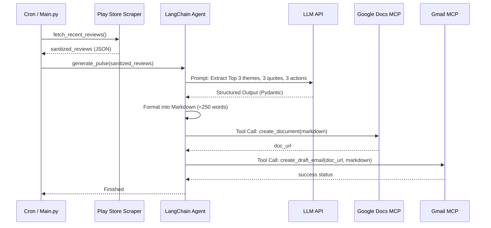

# Detailed System Architecture: Groww App Review AI Agent

## 1. System Overview
The Groww App Review Pulse Generator is an autonomous AI agent built to extract public Google Play Store reviews, analyze them to identify key themes, and distribute the synthesized insights via Google Docs and Gmail. 
The system relies on **LangChain** for orchestration and reasoning, and **Model Context Protocol (MCP)** servers to securely interface with Google Workspace without directly handling OAuth or REST APIs.

---

## 2. Proposed Directory Structure
A standard Python-based modular project structure is recommended for this system:

```text
groww-pulse-agent/
├── src/
│   ├── main.py                  # Entry point (Cron job or manual trigger)
│   ├── scraper/
│   │   └── play_store.py        # Logic for fetching & sanitizing reviews
│   ├── agent/
│   │   ├── chains.py            # LangChain LCEL chains for summarization
│   │   ├── prompts.py           # System prompts and templates
│   │   └── models.py            # Pydantic schemas for structured output
│   └── mcp_clients/
│       ├── docs_client.py       # Interacts with Google Docs MCP server
│       └── gmail_client.py      # Interacts with Gmail MCP server
├── requirements.txt
├── .env                         # LLM API keys (No Google Auth keys needed here)
└── README.md
```

---

## 3. Core Component Deep-Dive

### A. Data Ingestion Service (`src/scraper/play_store.py`)
*   **Library:** `google-play-scraper` (Python).
*   **Target:** `com.nextbillion.groww`
*   **Execution:** 
    *   Fetches the most recent reviews.
    *   Filters reviews to ensure they fall within the trailing 8–12 weeks.
    *   **Sanitization Step:** Strips reviewer names and avatars to maintain strict privacy.
*   **Output:** A list of dictionaries containing `{id, date, rating, content}`.

### B. AI Agent Orchestration (`src/agent/`)
This is the "brain" of the application, utilizing **LangChain** to process data and coordinate actions.

*   **LLM Provider:** Groq (Model: `openai/gpt-oss-120b`).
    *   **Rate Limits:** 30 Requests Per Minute (RPM), 1K Requests Per Day (RPD), 8K Tokens Per Minute (TPM), 200K Tokens Per Day (TPD). 
    *   **Implication:** The 8K TPM limit necessitates careful chunking and batching of reviews during the Map-Reduce phase.
*   **Structured Output (Pydantic):** 
    LangChain's `with_structured_output` will be used to force the LLM to return exactly what is required.
    ```python
    class PulseReport(BaseModel):
        themes: List[str] = Field(description="Top 3 themes", max_items=3)
        quotes: List[str] = Field(description="3 verbatim quotes", max_items=3)
        actions: List[str] = Field(description="3 concrete action ideas", max_items=3)
    ```
*   **Processing Strategy:**
    1.  **Map-Reduce / Batching (if volume is high):** LangChain summarizes chunks of reviews into intermediate themes.
    2.  **Final Extraction:** Generates the structured `PulseReport`.
    3.  **Document Generation:** A final prompt takes the `PulseReport` and formats it into a concise (≤ 250 words) Markdown string.

### C. MCP Integration Layer (`src/mcp_clients/`)
The agent communicates with local MCP servers (which handle all Google authentication) over Standard IO (`stdio`) or Server-Sent Events (`SSE`).

*   **Docs Client:** 
    *   Exposes a LangChain `@tool` (e.g., `publish_to_docs(content: str) -> str`).
    *   Calls the MCP Server to create a new Google Doc and returns the Document URL.
*   **Gmail Client:** 
    *   Exposes a LangChain `@tool` (e.g., `draft_email(subject: str, body: str) -> bool`).
    *   Calls the MCP Server to draft an email containing the generated Pulse note and/or the Docs URL.

---

## 4. Detailed Execution Flow



---

## 5. Technology Stack Summary
*   **Programming Language:** Python 3.10+
*   **Frameworks:** LangChain (Core, Prompts, Output Parsers, Tools)
*   **Scraping:** `google-play-scraper`
*   **LLM SDK:** `langchain-groq`
*   **MCP Protocol:** Official `mcp` python SDK to wrap server interactions into LangChain tools.

---

## 6. Implementation Phases

1.  **Phase 1 - Scraper Foundation:** Implement and test the Play Store scraper. Ensure data is sanitized and limited to the correct date range.
2.  **Phase 2 - LangChain Reasoning:** Build the Pydantic models, prompt templates, and the LangChain pipeline to transform raw JSON reviews into the structured Markdown pulse.
3.  **Phase 3 - MCP Connectivity:** Write clients to connect to the running Google Docs and Gmail MCP servers.
4.  **Phase 4 - Agent Assembly:** Bind the MCP clients as tools to the LangChain agent, allowing it to autonomously publish the report and draft the email based on the generated insights.
